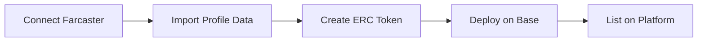
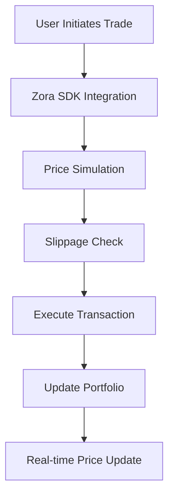
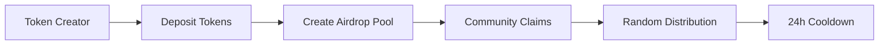

# 🪙 Farcoins - Social coin your farcaster Profile - Trading Platform

[](https://farcoins.xyz)
[](https://nextjs.org)
[](https://base.org)
[](https://farcaster.xyz)

> **Turn your Farcaster profile into a tradeable social token (using zora sdk) and build your creator economy on Base blockchain.**

Farcoins is a Next.js-based - farcaster miniapp profile coin - trading platform that seamlessly integrates with Farcaster and zora, enabling users to create, trade, and promote profile-based with advanced social features and airdrop mechanisms.

## 🌟 Key Features

### 🎭 **Farcaster Profile Coins**
- **One-Click Creation**: Transform your Farcaster profile into a tradeable token
- **Auto-populated Data**: Profile information (name, avatar, bio) automatically imported from Farcaster
- **Social Verification**: Direct integration with Farcaster for authentic social tokens

### 📈 **Advanced Trading System**
- **Zora SDK Integration**: Native trading through Zora protocol on Base blockchain
- **Real-time Price Charts**: Powered by CoinGecko API for accurate market data
- **Portfolio Tracking**: Complete portfolio management 
- **Slippage Protection**: Configurable slippage tolerance for safe trading

### 🎁 **Airdrop & Marketing System**
- **Token Airdrops**: Deposit your tokens for community airdrops to boost visibility
- **Smart Contracts**: Secure claim mechanism with 24-hour cooldown periods
- **Random Distribution**: Fair distribution algorithm (up to 1% of pool per claim)
- **Marketing Incentives**: Drive engagement and token adoption through airdrops

### 🚀 **Promotion Features**
- **Coin Promotion**: Paid promotion system for increased visibility
- **Leaderboard**: Community-driven ranking system
- **Social Sharing**: Built-in Farcaster Frame integration for viral sharing

### 🔗 **Multi-Platform Support**
- **Farcaster Mini App**: Native in-app experience with Frame integration
- **Web Application**: Full-featured website at [farcoins.xyz](https://farcoins.xyz)
- **Mobile Responsive**: Optimized for all device sizes

## 🛠 Tech Stack

Farcoins is built on five core platforms providing a robust and scalable foundation:

### 1. 🎨 **[Zora SDK](https://docs.zora.co)**
- **Token Trading**: Native Uniswap V4 integration for seamless swaps
- **Market Data**: Real-time price feeds and trading volumes  
- **Liquidity Management**: Automated market making and pool creation
- **Creator Monetization**: Revenue sharing for token creators

### 2. 📡 **[Neynar API](https://neynar.com)**
- **User Data**: Comprehensive Farcaster user profiles and social graphs
- **Real-time Sync**: Automatic profile updates and social connections
- **Smart Caching**: 10-day cache system for optimal performance
- **Social Verification**: Authentic user data from Farcaster network

### 3. 🎭 **[Farcaster SDK](https://docs.farcaster.xyz)**
- **Frame Integration**: Native Farcaster Frame support for in-app trading
- **Wallet Connection**: Seamless wallet connection within Farcaster
- **Social Actions**: Cast creation, likes, and social interactions
- **Mini App**: Full mini-app experience with native navigation

### 4. 🗄️ **[Supabase](https://supabase.com)**
- **Database**: PostgreSQL with real-time subscriptions
- **Authentication**: Secure user authentication and session management

### 5. ⚡ **[Alchemy SDK](https://alchemy.com)**
- **Portfolio Tracking**: Real-time token balance tracking across Base network
- **Token Metadata**: Comprehensive token information and logos
- **Batch Operations**: Efficient multi-token data fetching
- **Cache Management**: 24-hour caching for optimal performance  

## 🏗 Architecture & Core Technologies

### **Frontend Stack**
- **Framework**: Next.js 14 with App Router for optimal performance
- **Language**: TypeScript for type-safe development
- **Styling**: Tailwind CSS with custom metal effects system
- **UI Components**: Radix UI + shadcn/ui for accessible design
- **State Management**: TanStack Query for server state management

### **Blockchain Integration**
- **Network**: Base (Ethereum L2) for low-cost transactions
- **Web3 Library**: Wagmi + Viem for blockchain interactions
- **Smart Contracts**: Custom claim factory and ERC token contracts
- **Wallet Support**: MetaMask, WalletConnect, and Farcaster Wallet,...

### **Backend Services**
- **API Routes**: Next.js API routes for serverless functions
- **Database**: Supabase PostgreSQL with real-time features
- **External APIs**: Integration with Zora, Neynar, CoinGecko, and Alchemy
- **Caching**: Redis for API response caching and rate limiting

## 📁 Project Structure

```
Farcoins/
├── 📱 app/                          # Next.js App Router
│   ├── airdrop/page.tsx            # Airdrop claim interface
│   ├── api/                        # API endpoints
│   │   ├── 0x-proxy/route.ts       # 0x API proxy for trading (only for $GM token)
│   │   ├── og/token/route.tsx      # Dynamic OG image generation
│   │   ├── send-notification/      # Push notification service (farcaster)
│   │   └── webhook/route.ts        # External webhook handler (farcaster)
│   ├── create/page.tsx             # Token creation interface
│   ├── leaderboard/page.tsx        # users rankings
│   ├── profile/page.tsx            # User profile & portfolio
│   ├── promote/page.tsx            # Token promotion system
│   ├── token/[username]/           # Dynamic token pages
│   │   ├── layout.tsx              # Token page layout with metadata
│   │   └── page.tsx                # Individual token trading interface
│   ├── layout.tsx                  # Root layout with providers
│   └── page.tsx                    # Homepage with token discovery
│
├── 🧩 components/                   # Reusable UI components
│   ├── airdrop/                    # Airdrop-related components
│   │   ├── airdrop-token-list.tsx  # User's depositable tokens
│   │   ├── claimable-tokens-list.tsx # Available airdrops to claim
│   │   └── deposit-card.tsx        # Token deposit interface
│   ├── home/                       # Homepage components
│   │   ├── create-profile-coin-card.tsx # CTA for profile token creation
│   │   ├── filter-section.tsx      # Token filtering controls
│   │   ├── token-card.tsx          # Individual token display card
│   │   └── token-grid.tsx          # Token discovery grid layout
│   ├── profile/                    # Profile & portfolio components
│   │   ├── portfolio-tab.tsx       # Alchemy-powered portfolio view
│   │   ├── profile-content.tsx     # Main profile content layout
│   │   ├── profile-header.tsx      # User info and stats
│   │   ├── user-portfolio.tsx      # Token holdings summary
│   │   └── user-profile.tsx        # Farcaster profile integration
│   ├── token/                      # Token trading components
│   │   ├── advanced-trade-panel.tsx # Zora SDK trading interface
│   │   ├── gm-advanced-trade-panel.tsx # Special GM token trading
│   │   ├── hybrid-advanced-trade-panel.tsx # Multi-provider trading
│   │   ├── token-details.tsx       # Token information display
│   │   ├── token-frame-meta.tsx    # Farcaster Frame metadata
│   │   ├── token-share-button.tsx  # Social sharing functionality
│   │   ├── token-zora-button.tsx   # Zora marketplace integration
│   │   └── trade-panel.tsx         # Basic trading interface
│   ├── ui/                         # shadcn/ui components
│   │   ├── button.tsx, card.tsx, dialog.tsx, etc. # Base UI primitives
│   │   └── transaction-modal.tsx   # Web3 transaction handling
│   ├── bottom-navigation.tsx       # Mobile navigation
│   ├── farcaster-provider.tsx      # Farcaster SDK context
│   ├── header.tsx                  # Main navigation header
│   ├── price-chart.tsx             # Token price visualization
│   ├── stats-section.tsx           # Platform statistics
│   └── wallet-connect.tsx          # Multi-wallet connection
│
├── 🔗 hooks/                       # Custom React hooks
│   ├── use-coins.ts                # Token data management
│   ├── use-farcaster.ts            # Farcaster user data with Neynar
│   ├── use-farcaster-context.ts    # Farcaster SDK integration
│   ├── use-portfolio.ts            # Alchemy portfolio management
│   ├── use-token-balance.ts        # Individual token balances
│   ├── use-token-claim-contract.ts # Airdrop smart contract interaction
│   ├── use-token-approval.ts       # ERC-20 approval handling
│   └── use-transaction-modal.ts    # Transaction UI state
│
├── 📚 lib/                         # Core services and utilities
│   ├── airdrops-service.ts         # Airdrop pool management
│   ├── alchemy-portfolio-service.ts # Alchemy SDK integration
│   ├── alchemy-service.ts          # Alchemy API wrapper
│   ├── coins-service.ts            # Token data from Supabase
│   ├── daily-claims-service.ts     # Claim tracking and limits
│   ├── gm-token-trading-service-0x.ts # 0x API trading service
│   ├── leaderboard-service.ts      # Community rankings logic
│   ├── metal-effects.ts            # Custom CSS animation system
│   ├── neynar.ts                   # Farcaster user data fetching
│   ├── notifs.ts                   # Push notification service
│   ├── og-utils.ts                 # Open Graph image generation
│   ├── promotion-service.ts        # Token promotion management
│   ├── react-query-config.ts       # TanStack Query configuration
│   ├── supabase.ts                 # Database client setup
│   ├── utils.ts                    # General utility functions
│   ├── wagmi-config.ts             # Web3 wallet configuration
│   ├── zora-service.ts             # Zora protocol integration
│   └── zora-trading-service.ts     # Zora SDK trading implementation
│
├── 📊 assets/                      # Static assets and configurations
│   ├── contract/                   # Smart contract files
│   │   ├── ABI.txt                 # Contract ABIs
│   │   ├── claimfactory.sol        # Airdrop claim contract
│   │   └── ClankerContract.sol     # Token creation contract
│   └── sql/                        # Database schema and migrations
│       ├── airdrop_tables.sql      # Airdrop system tables
│       └── scripts/                # Database migration scripts
│           ├── create-coins-table.sql      # Token metadata table
│           ├── create-users-table.sql      # Farcaster user data
│           ├── create-daily-claims-table.sql # Claim tracking
│           ├── create-promotions-table.sql # Token promotion system
│           └── create-leaderboard-view.sql # Analytics views
│
├── 🎨 styles/                      # Global styling
│   └── globals.css                 # Tailwind CSS with custom effects
│
├── ⚙️ Configuration files
│   ├── next.config.mjs             # Next.js configuration
│   ├── tailwind.config.ts          # Tailwind CSS setup
│   ├── tsconfig.json               # TypeScript configuration
│   ├── components.json             # shadcn/ui configuration
│   └── package.json                # Dependencies and scripts
│
└── 📝 Documentation
    ├── README.md                   # Project overview and setup
```

### 🎯 **Key File Functions**

#### **Core Trading System**
- `zora-trading-service.ts` - Handles all token trading through Zora SDK
- `advanced-trade-panel.tsx` - Main trading interface with slippage protection
- `use-token-approval.ts` - Manages ERC-20 token approvals for trading

#### **Airdrop System**
- `claimfactory.sol` - Smart contract managing airdrop pools and claims
- `airdrops-service.ts` - Database operations for airdrop tracking
- `use-token-claim-contract.ts` - Contract interaction hooks

#### **Social Integration**
- `farcaster-provider.tsx` - Farcaster SDK context and authentication
- `use-farcaster.ts` - User data fetching with Neynar API integration
- `token-frame-meta.tsx` - Generates Farcaster Frame metadata for sharing

#### **Portfolio Management**
- `alchemy-portfolio-service.ts` - Real-time portfolio tracking via Alchemy SDK
- `use-portfolio.ts` - Portfolio data management with caching
- `portfolio-tab.tsx` - UI for displaying user's token holdings

#### **Token Creation**
- `coins-service.ts` - Database operations for token metadata
- `create-coin-form.tsx` - UI for profile token creation
- `og-utils.ts` - Dynamic social sharing image generation

## 🔄 How It Works

### **1. Profile Coin Creation**


1. **Connect**: User connects their Farcaster account
2. **Import**: Profile data (name, image, bio) auto-imported from Farcaster
3. **Create**: ERC token created with profile information
4. **Deploy**: Smart contract deployed on Base blockchain
5. **List**: Token becomes tradeable on the platform

### **2. Trading Mechanism**


- **Price Discovery**: Real-time pricing through Zora protocol
- **Liquidity**: Automated market making via Uniswap V4
- **Transaction Safety**: Built-in slippage protection and simulation
- **Portfolio Tracking**: Automatic P&L calculation and history

### **3. Airdrop System**


1. **Deposit**: Token creators deposit tokens to airdrop contract
2. **Pool Creation**: Smart contract creates claimable pool
3. **Community Access**: Other users can claim from available pools
4. **Fair Distribution**: Random amount up to 1% of pool per claim
5. **Cooldown**: 24-hour waiting period between claims

### **4. Social Integration**
- **Farcaster Frames**: Shareable trading interfaces within Farcaster
- **Social Verification**: Direct integration with Farcaster social graph
- **Viral Mechanics**: Built-in sharing and promotion tools
- **Community Building**: Follow/unfollow mechanics tied to token holding

## 📋 Smart Contracts

### **Token Claim Factory** (`claimfactory.sol`)
- **Address**: Deployed on Base mainnet
- **Purpose**: Manages airdrop pools and claim mechanisms
- **Features**: 
  - Random distribution algorithm
  - 24-hour claim cooldown
  - Pool management and balance tracking
  - Event emission for transparency

### **Key Functions**:
```solidity
function depositToken(address _token, uint256 _amount) external;
function claimToken(address _token) external;
function getPoolInfo(address _token) external view returns (uint256, address);
function getNextClaimTime(address _token, address _user) external view;
```

## 🚀 Getting Started

### **Prerequisites**
- Node.js 18+ and npm/yarn/pnpm
- MetaMask or compatible Web3 wallet
- Farcaster account for full features

### **Installation**


2. **Install dependencies**
```bash
pnpm install
```

3. **Environment setup**
```bash
cp .env.example .env.local
```

4. **Configure environment variables**
```env
# Supabase Configuration
NEXT_PUBLIC_SUPABASE_URL=your_supabase_url
NEXT_PUBLIC_SUPABASE_ANON_KEY=your_supabase_anon_key

# Neynar API
NEYNAR_API_KEY=your_neynar_api_key

# Farcaster
NEXT_PUBLIC_FARCASTER_APP_ID=your_farcaster_app_id

# Blockchain
NEXT_PUBLIC_WALLETCONNECT_PROJECT_ID=your_walletconnect_id
NEXT_PUBLIC_ALCHEMY_API_KEY=your_alchemy_api_key

# External APIs
COINGECKO_API_KEY=your_coingecko_api_key
```

5. **Run the development server**
```bash
pnpm dev
```

6. **Open [http://localhost:3000](http://localhost:3000)**

### **Database Setup**

1. **Create Supabase project**
2. **Run database migrations**
```bash
pnpm run migrate
```

3. **Configure RLS policies** (see `assets/sql/` for complete scripts)

## 📱 Usage Guide

### **Creating Your Profile Coin**

1. **Connect Wallet & Farcaster**: Use the wallet connect button in the header
2. **Navigate to Create**: Click "Create Your Coin" from the homepage
3. **Auto-fill Profile**: Your Farcaster data will be automatically imported
4. **Customize Details**: Adjust name, symbol, and description as needed
5. **Deploy Token**: Confirm transaction to deploy your ERC token
6. **Start Trading**: Your token is now live and tradeable!

### **Trading Tokens**

1. **Browse Tokens**: Use the homepage to discover available tokens
2. **Select Token**: Click on any token to view detailed information
3. **Connect Wallet**: Ensure your wallet is connected to Base network
4. **Place Trade**: Use the trading panel to buy/sell with slippage protection
5. **Track Portfolio**: Monitor your holdings via Alchemy-powered portfolio in profile section

### **Creating Airdrops**

1. **Own a Token**: Must have created a profile token first
2. **Navigate to Airdrop**: Use the airdrop page to manage distributions
3. **Deposit Tokens**: Use the deposit modal to add tokens to airdrop pool
4. **Community Claims**: Other users can now claim from your pool
5. **Marketing Boost**: Airdrops increase token visibility and adoption

### **Claiming Airdrops**

1. **Browse Available**: Check the airdrop page for claimable tokens
2. **Connect Farcaster**: Must have connected Farcaster account
3. **Claim Tokens**: Click claim on any available airdrop
4. **24h Cooldown**: Wait 24 hours before claiming from the same pool again
5. **Build Portfolio**: Accumulate various tokens through community airdrops

## 🛡 Security Features

- **Smart Contract Auditing**: Secure claim mechanisms with proper access control
- **Row Level Security**: Database-level security for user data protection
- **Rate Limiting**: API rate limiting to prevent abuse
- **Input Validation**: Comprehensive validation for all user inputs
- **Slippage Protection**: Trading safeguards against MEV and price manipulation


## 🤝 Contributing

We welcome contributions from the community! Here's how to get started:

### **Development Workflow**
1. Fork the repository
2. Create a feature branch (`git checkout -b feature/amazing-feature`)
3. Commit your changes (`git commit -m 'Add amazing feature'`)
4. Push to the branch (`git push origin feature/amazing-feature`)
5. Open a Pull Request

### **Code Standards**
- **TypeScript**: Strict type checking enabled
- **ESLint**: Code linting and formatting
- **Component Patterns**: Use functional components with hooks
- **File Naming**: kebab-case for files, PascalCase for components
- **Testing**: Write tests for critical functionality

### **Architecture Guidelines**
- **5-Platform Integration**: Maintain consistency across Zora, Neynar, Farcaster, Supabase, and Alchemy
- **Error Handling**: Implement graceful fallbacks for API failures
- **Performance**: Utilize caching strategies for optimal user experience
- **Security**: Follow Web3 best practices for wallet and contract interactions


## 🌐 Links & Resources

- **Website**: [farcoins.xyz](https://farcoins.xyz)
- **Farcaster**: [@gmonchain.eth](https://warpcast.com/gmonchain)
- **Twitter**: [@gmonchains](https://twitter.com/gmonchains)

## 📜 License

This project is licensed under the MIT License - see the [LICENSE](LICENSE) file for details.

## 🙏 Acknowledgments

- **Zora Labs**: For the amazing SDK and creator tools
- **Neynar**: For comprehensive Farcaster API services
- **Farcaster Team**: For building the decentralized social protocol
- **Base Team**: For the fast and affordable L2 infrastructure
- **Supabase**: For the developer-friendly database platform

---

<div align="center">

**Built with ❤️ by the gmonchain Team**

</div>
